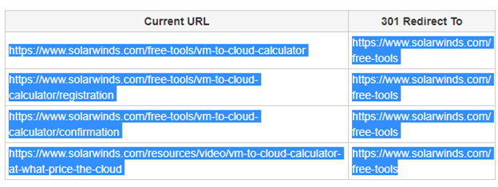

# Redirects
The redirect tester tool is an app developed to test the redirects and its response codes. The main idea of the application is to make easier to check a list of redirects by automating most of the process.

(public/tool.gif)

# How it Works
This software takes a list of redirects from the clipboard and then compare origin URLs against destiny URLs.

# Additional notes
* This application runs with Selenium Web driver, so it is necessary to have the Chrome driver installed in the same path of the app.
* It is highly recommended to create a back up of your "hosts" file before start using the application. 
* Also, please add a line break at the end of the "hosts" file. There is a unknown issue when editing this file so adding the line break will prevent the file gets corrupted. In case you need it, this is the path of the "hosts" file: C:\Windows\System32\Drivers\etc

# Prerequisites
* A computer running on Windows 10, 8 or 7.
* At least 35MB of RAM memory.
* 25MB of free hard disk space.
* Internet connection.

# Using the application
The use of this application was intended to automate the test of redirects. To complete this, the app will need, as minimum, one source and one destiny IP.

##Copy your URLs to the clipboard
You can copy the URLs to your clipboard from sources that divide the URLs into 2 columns: source and destiny.

**Notice that for both examples the titles of the columns are NOT selected. Selecting the titles of the tables might produce the application crashes.**

##Adding the URLs
Once you copied the URLs into the clipboard, click on the **_ _“Paste from Clipboard”_ _** button: 

(public/copyUrls.png)

This will automatically validate and add the URLs to the application. Once the process is done, you will receive a notification message:

(public/appWorking.png)

Close the message to make visible the URLs in the results panel:

(public/urlsCopied.png)

##Starting to test
* Once you added the URLs, you can change the configurations on the right side of the application. For **staging** test, make sure both the IP and URL on the _ _“Environment Configuration”_ _ box are according to the ones provided by Akamai.

**IMPORTANT:** If you leave the **_ _“Live Test”_ _** check unchecked, the system will write in the hosts file using the information provided in the _ _“Environment Configuration”_ _ box. So, it is very important to make sure the data on these fields are ok, otherwise the test will fail.

On the other hand, the **_ _“Show Browser”_ _** check let you choose if you want to watch the browser running during the test or not. This option is **unmarked  by default.**

(public/configuration.png)

* Next step is to choose the proper response code you want to test in the _ _“Response”_ _ box:

(public/response.png)

* When the configuration is done, you can start testing by clicking on the **_ _“Start”_ _** button. A modal window will open while the tests is running: 

(public/progressGood.png)

* **In case the app finds any invalid redirect, the progress bar will turn its color into red:**

(public/progressBad.png)

* After the test is done, you will receive a confirmation message and will be able to see the results in the results panel:

(public/infoMessage.png)

And that's it! The redirects are finally tested. You can take a look at the results in the status column of the result panel:

(public/appResults.png)

#Additional notes

* This application runs with Selenium Web driver, so it is necessary to have the Chrome driver installed in the same path of the app.
* It is highly recommended to create a **back up of your _ _"hosts"_ _** file before start using the application. 

(public/hosts.png)

* Also, please **add a line break at the end of the _ _"hosts"_ _** file. There is a unknown issue when editing this file so adding the line break will prevent the file gets corrupted. In case you need it, this is the path of the "hosts" file: C:\Windows\System32\Drivers\etc
* If you want to change the default path of the "hosts" file, the default staging URL or the default documentation URL, you can modify the **"config.cfg"** file. Do not change the order of the values or the application might crash.

(public/configCfg.png)
